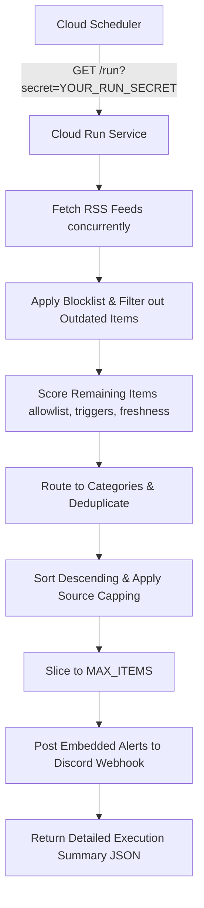

# Mantaw — Personal News Radar

A lightweight personal news radar that watches RSS sources, filters important updates, scores them, and sends curated alerts to Discord.

---

## What is Mantaw?
Mantaw is **not a full news platform** or a reader app. It is a self-hosted news radar and background worker designed to help you stay aware of important tech and AI updates without manually checking multiple blogs, X/Twitter, Reddit, GitHub, or newsletters. 

It runs as a stateless FastAPI service on **Google Cloud Run**, triggered periodically by **Google Cloud Scheduler**, and sends filtered alerts directly to a **Discord channel** via a Webhook.

---

## Why This Exists (Problem it Solves)
- **Information Overload**: Checking multiple tech blogs and developer portals daily is tiring and time-consuming.
- **Velocity of Tech/AI/Crypto**: Industry updates move incredibly fast, making it easy to miss significant releases, exploits, or announcements.
- **High Noise-to-Signal Ratio**: Most tech feeds are filled with promotional content, listicles, or irrelevant news.
- **Centralized Stream**: Mantaw resolves this by centralizing high-value signals into a single Discord channel. It acts as an automated filter, helping you notice interesting trends and topics rather than reading every article.

---

## Core Use Cases
- **Personal Tech Intelligence**: Keeping a pulse on the general tech ecosystem.
- **AI/Robotics Monitor**: Tracking model releases, hardware advancements, and research breakthroughs.
- **Crypto & Security Radar**: Fast notifications about smart contract exploits, system breaches, wallet drains, and vulnerabilities.
- **Trending Project Discovery**: Capturing new repositories and developer trends via GitHub Trending.
- **Content Idea Generation**: Discovering articles and news to turn into tweets, blog posts, video topics, newsletters, or research notes.
- **Doomscrolling Prevention**: Staying aware and informed through scheduled alerts rather than constant checking.

---

## Feature Overview
- **RSS Feed Monitoring**: Automates checking of diverse tech blogs, community news, and trending repositories.
- **Keyword Allowlist**: Filters items based on custom keyword scoring.
- **Blocklist & Noise Filtering**: Automatically ignores promotions, listicles, WordPress spam, and outdated reviews.
- **Weighted Scoring**: Evaluates articles using keywords, important triggers, and financial/scale indicators.
- **Freshness Bonus (v0.2)**: Assigns higher scores to very recent articles (published within 24h or 3 days).
- **Recency Filter (v0.2)**: Automatically discards articles older than a configurable day threshold (`MAX_ITEM_AGE_DAYS`).
- **Category Detection**: Labels items into `AI`, `AI/Robotics`, `Crypto/Security`, or `Tech`.
- **Deduplication**: Prevents duplicate alerts from cross-posted links.
- **Source Capping (v0.2)**: Restricts the number of alerts sent per source (`MAX_ITEMS_PER_SOURCE`) so that one feed does not dominate the notifications.
- **Discord Alert Formatting**: Packages matches into neat, rich embeds containing scores, categories, timestamps, snippets, and link tags.
- **Stateless & Scalable**: Deployed via Docker container to Google Cloud Run, running on demand.
- **Secured Endpoint**: Protecting `/run` using a secret query token verification.
- **CI/CD Integration**: Streamlined deployments on push to `main` via GitHub Actions and secure Workload Identity Federation (WIF).

---

## How It Works

The system operates as a stateless scheduled worker:

---

## Alert Interpretation Guide

A typical Mantaw alert in Discord contains:
- **Category Badge**: e.g., `[AI]`, `[Crypto/Security]`
- **Emoji Priority**: 🔥 indicates high importance (Score $\ge$ 6); 👀 indicates typical relevance.
- **Score**: Shows the calculated relevance based on keyword density and trigger match.
- **Matched Keywords**: Highlights which allowlist terms matched (e.g., `openai`, `llm`).
- **Published Date**: Shows the age of the article. An `(Unparseable/Missing Date)` suffix indicates the item had no standard RFC 2822 published date but was preserved.
- **Snippet**: A concise 250-character summary.
- **Link**: Clicking the title redirects directly to the source.

> [!NOTE]
> **Interpretation Rules:**
> 1. **High score does not mean "must read"**: It indicates a strong signal matching your allowlist criteria.
> 2. **Check source and date**: Make sure you verify the origin and release date before sharing or writing content.
> 3. **Tuning is normal**: If you see too much noise or miss certain events, adjust your keyword and blocklist variables in `main.py`.

---

## Scoring Explanation

Mantaw calculates scores using the following weights:
- **Allowlist Keywords**: `+1` score for each matched keyword.
- **Important Trigger Words** (*announces, launch, released, research, vulnerability, exploit, breach*): `+2` score.
- **Financial/Scale Indicators** (*$, million, billion, trillion*): `+2` score.
- **Freshness Bonus**:
  - `+2` score if published within the last 24 hours.
  - `+1` score if published within the last 3 days.
- **Unparseable Date Penalty**: `-2` score if the publication date cannot be parsed (ensures missing dates are deprioritized but not completely silenced).
- **Priority Threshold**: Items are only considered if their final score $\ge$ `MIN_SCORE` (default: 4).

---

## Configuration Guide

The service is configured using standard environment variables:

| Variable Name | Required | Default Value | Description |
| :--- | :--- | :--- | :--- |
| `DISCORD_WEBHOOK_URL` | **Yes** | *None* | Target Discord channel Webhook URL. |
| `RUN_SECRET` | No | *None* | Secret token query parameter required to authenticate `/run`. |
| `MIN_SCORE` | No | `4` | Minimum score threshold for alerts to be delivered. |
| `MAX_ITEMS` | No | `10` | Maximum number of alerts sent to Discord per trigger. |
| `MAX_ITEM_AGE_DAYS` | No | `14` | Discard articles published older than this value. |
| `MAX_ITEMS_PER_SOURCE` | No | `3` | Maximum number of alerts allowed from a single source per trigger. |

### Code Customization
To customize source feeds, keywords, or categorization rules, modify `app_build/main.py` directly:
- **RSS Sources**: Edit the `FEEDS` dictionary.
- **Keywords Allowlist**: Edit `ALLOWLIST` to adjust terms of interest.
- **Keywords Blocklist**: Edit `BLOCKLIST` to filter out spam, listicles, or advertisement topics.
- **Trigger Words**: Edit `IMPORTANT_WORDS` or `MONEY_INDICATORS` to customize importance weighting.
- **Category Rules**: Adjust keyword mappings in `CRYPTO_WORDS`, `AI_ROBOT_WORDS`, and `AI_WORDS` to alter routing.

---

## Current Default Sources
Mantaw monitors the following sources by default:
1. **TechCrunch** (`https://feeds.feedburner.com/TechCrunch/`)
2. **The Verge** (`https://www.theverge.com/rss/index.xml`)
3. **OpenAI News** (`https://openai.com/news/rss.xml`)
4. **Hacker News** (`https://hnrss.org/frontpage`)
5. **GitHub Trending** (`https://mshibanami.github.io/GitHubTrendingRSS/daily/all.xml`)

---

## Limitations
- **RSS-Only**: Limited to monitoring standard RSS/Atom feeds; cannot scrape social networks (X, Reddit) or paywalled blogs directly.
- **No Database**: Operational state is completely memory-based. It does not persist article histories or deduplicate across scheduled runs.
- **No UI/Dashboard**: Setup, monitoring, and configurations are managed purely through environment variables and code.
- **No Article Extraction**: Relies on feed summary snippets; cannot pull or read full web page bodies.
- **No Truth Verification**: Scores articles based on keyword presence, not factual validation.

---

## Project Roadmap
- [x] **Recency Filter**: Skip articles older than $X$ days.
- [x] **Source Capping**: Prevent feed domination.
- [ ] **Config YAML**: Support externalizing keyword configurations to a separate YAML file.
- [ ] **AI Summary Mode**: Integrate lightweight LLM summarization before posting to Discord.
- [ ] **Per-Niche Discord Channels**: Route alerts to different webhooks based on category.
- [ ] **Firestore/Supabase Config**: Persist settings and history in a backend database.
- [ ] **Web Dashboard**: Create a simple dashboard for managing feeds and reading statistics.

---

## Deployment & Setup Guide

For technical guides on running locally, building Docker images, configuring Google Cloud IAM Workload Identity Federation, and automated deployment via GitHub Actions, refer to the technical setup manual:

👉 **[App Setup & Deployment Guide (app_build/README.md)](file:///c:/learm/mantaw/app_build/README.md)**
