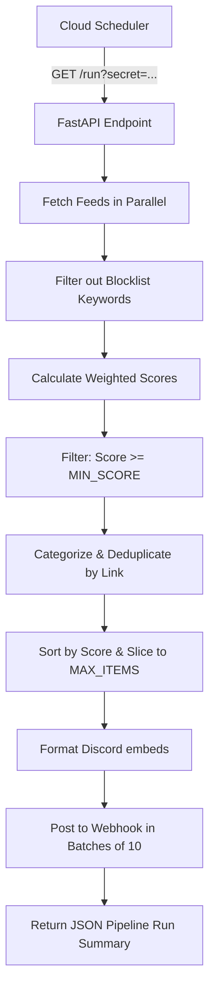

# Mantaw - Personal News Radar

**Mantaw** is a scheduled, self-hosted personal news radar designed to scan the web for high-value updates on Artificial Intelligence, Robotics, Tech Startups, and Crypto/Security. It operates as a stateless HTTP worker deployed on Google Cloud Run, periodically triggered by Google Cloud Scheduler, and delivers curated highlights directly to a Discord channel via Webhook.

---

## Key Features

- ⚡ **Asynchronous Parallel Fetching**: Concurrently queries and parses multiple RSS feeds (TechCrunch, The Verge, OpenAI, Hacker News, GitHub Trending) using `httpx` and `feedparser` to maximize performance.
- 🎯 **Double-Pass Keyword Filtering**:
  - **Allowlist Scan**: Scans title and summary for target terms (e.g., *nvidia, openai, humanoid, exploit, llm*).
  - **Blocklist Filter**: Instantly discards articles containing spam, coupons, betting, or sponsored promotions.
- 📈 **Weighted Scoring Engine**: Assigns priority values to incoming articles:
  - `+1` for each matching allowlist keyword.
  - `+2` for release, launch, vulnerability, or major announcement indicators (*announces, launch, exploit, breach, research*).
  - `+2` for financial and market scale triggers (*$, million, billion, trillion*).
- 🏷️ **Smart Categorization**: Automatically classifies news into channels based on content:
  - **Crypto/Security** (exploits, wallets, bitcoin, security breaches)
  - **AI/Robotics** (GPUs, humanoid robots, NVIDIA, robotics)
  - **AI** (OpenAI, Anthropic, LLMs, model releases)
  - **Tech** (General technology & startup news)
- 🧹 **Deduplication & Ranking**: Prevents duplicate stories from multiple feeds, sorts the final selection by score in descending order, and caps alerts to a configurable `MAX_ITEMS` per cycle.
- 🎨 **Discord Rich Embeds**: Formats alerts using Discord Embed payloads with emoji badges (🔥 for high priority $\ge$ 6, 👀 otherwise), category tags, matched keywords list, publication timestamps, and snippets with defensive length limits.
- 🛡️ **Fault Tolerance & Reliability**: A failure to retrieve or parse any single feed does not interrupt the pipeline execution. Webhook failures are handled gracefully, logging the Discord API response body for quick debugging.

---

## Data Pipeline Flow



---

## API Documentation

The service exposes a minimalist, lightweight REST API.

### `GET /health`
Liveness and readiness probe endpoint.

- **URL**: `/health`
- **Method**: `GET`
- **Response Content-Type**: `application/json`
- **Success Response**: `{"ok": true}`

---

### `GET /run`
Triggers the RSS feed retrieval, scoring, filtering, and Discord webhook dispatch.

- **URL**: `/run`
- **Method**: `GET`
- **Query Parameters**:
  - `secret` (string, optional): Required if `RUN_SECRET` environment variable is defined on the host. Must match the secret exactly.
- **Success Response**:
  - **Code**: `200 OK`
  - **Content**:
    ```json
    {
      "status": "success",
      "processed_count": 145,
      "alerted_count": 3,
      "items": [
        {
          "title": "OpenAI Launches SearchGPT Prototype",
          "score": 8,
          "category": "AI",
          "source": "OpenAI",
          "link": "https://openai.com/news/searchgpt"
        }
      ]
    }
    ```
- **Error Responses**:
  - **Code**: `401 UNAUTHORIZED` - If `RUN_SECRET` is set in the environment but query parameter `secret` is missing or mismatching.
  - **Code**: `500 INTERNAL SERVER ERROR` - If `DISCORD_WEBHOOK_URL` environment variable is missing on the server.
  - **Code**: `502 BAD GATEWAY` - If posting to the Discord Webhook API fails.

---

## Environment Variables

| Variable Name | Required | Default Value | Description |
| :--- | :--- | :--- | :--- |
| `DISCORD_WEBHOOK_URL` | **Yes** | *None* | Discord channel webhook url to post news alerts. |
| `RUN_SECRET` | No | *None* | Authentication token required as query parameter to run `/run`. |
| `MIN_SCORE` | No | `4` | Minimum relevance score required for an article to be alerted. |
| `MAX_ITEMS` | No | `10` | Maximum number of alerts posted to Discord per trigger. |

---

## Quick Reference: Local Setup & Deployment

For detail guides on setting up local environment files (`.env`), building container images locally, mapping Workload Identity Federation (WIF) credentials on Google Cloud Platform, and scheduling execution cron jobs, please see the Setup and Deployment guide:

👉 **[App Setup & Deployment Guide (app_build/README.md)](file:///c:/learm/mantaw/app_build/README.md)**
