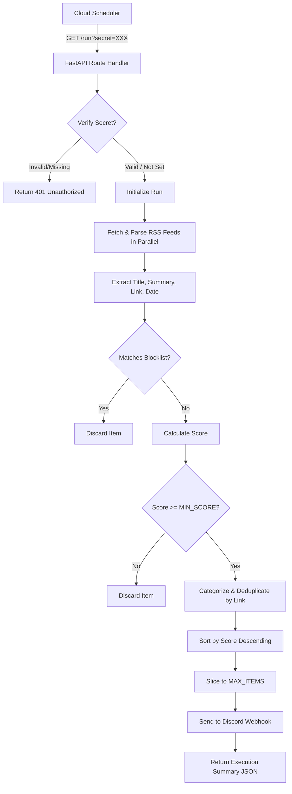

# Technical Specification: Mantaw - Personal News Radar Service

## Executive Summary
**Mantaw** is a lightweight, scheduled personal news radar service. It is designed as a Python backend application that runs inside a Google Cloud Run container. It is triggered periodically by Google Cloud Scheduler to fetch RSS feeds from selected tech and AI sources, filter and score them based on allowlist and blocklist keywords, deduplicate the results, and send the highest-scoring updates to a Discord channel via a Webhook.

---

## 1. Requirements

### 1.1 Functional Requirements
- **Endpoints**:
  - `GET /health`: Returns `{"ok": true}`. Used for readiness and liveness probes.
  - `GET /run`: Runs the news radar pipeline.
    - If `RUN_SECRET` environment variable is set, this endpoint must require a query parameter `?secret=<RUN_SECRET>`. If the secret is missing or incorrect, it returns HTTP 401 Unauthorized.
    - If `RUN_SECRET` is not set, the endpoint runs without authentication.
- **RSS Feeds to Monitor**:
  - TechCrunch: `https://feeds.feedburner.com/TechCrunch/`
  - The Verge: `https://www.theverge.com/rss/index.xml`
  - OpenAI: `https://openai.com/news/rss.xml`
  - Hacker News: `https://hnrss.org/frontpage`
  - GitHub Trending: `https://mshibanami.github.io/GitHubTrendingRSS/daily/all.xml`
- **Filtering & Keyword Matching**:
  - **Allowlist Keywords**: `nvidia`, `openai`, `anthropic`, `deepmind`, `google ai`, `meta ai`, `robot`, `robotics`, `humanoid`, `gpu`, `ai agent`, `agentic`, `crypto`, `bitcoin`, `ethereum`, `wallet`, `drained`, `exploit`, `hack`, `breach`, `security`, `github`, `open source model`, `startup`, `llm`, `cloud run`, `google cloud`, `model release`, `ai model`
  - **Blocklist Keywords**: `sponsored`, `giveaway`, `coupon`, `price prediction`, `promo`, `discount`, `casino`, `betting`
  - *Matching logic*: Case-insensitive substring matching against both the **title** and the **summary** (or description) of each RSS item.
  - *Blocklist action*: If an item matches any blocklist keyword, it is discarded immediately.
- **Scoring Engine**:
  - Start at `0` points.
  - **Allowlist score**: +1 for every matched allowlist keyword.
  - **Important words score**: +2 if title or summary contains any of these words: `announces`, `launch`, `released`, `release`, `research`, `model`, `security`, `exploit`, `hack`, `breach`, `vulnerability`.
  - **Scale/Money score**: +2 if title or summary contains scale indicators: `$`, `million`, `billion`, `juta`, `miliar`, `trillion`.
  - **Threshold**: Only items with a final score `>= MIN_SCORE` (default `4`) are kept.
- **Deduplication, Sorting, and Limits**:
  - **Deduplication**: Deduplicate items by their URL/link within the current run execution.
  - **Sorting**: Sort final filtered items by score descending.
  - **Limiting**: Limit the final list of sent alerts to `MAX_ITEMS` (default `10`).
- **Discord Notification Format**:
  - Send messages to `DISCORD_WEBHOOK_URL`.
  - Formatting rules:
    - **Emoji**: 🔥 if score >= 6, else 👀
    - **Category**: Derived category (see Category Rules below).
    - **Title**: Styled clearly.
    - **Score**: Displayed as `Score: X`.
    - **Matched keywords**: Bulleted or comma-separated list of keywords that triggered the match.
    - **Published date**: Original publication date from the feed.
    - **Short snippet**: A clean, trimmed summary.
    - **Link**: Clickable hyperlink to the article.
- **Category Rules**:
  - If matches `crypto`, `bitcoin`, `ethereum`, `wallet`, `exploit`, `hack`, `drained`: **Crypto/Security**
  - Else if matches `nvidia`, `gpu`, `robot`, `robotics`, `humanoid`: **AI/Robotics**
  - Else if matches `openai`, `anthropic`, `deepmind`, `model`, `agent`, `llm`: **AI**
  - Otherwise: **Tech**

### 1.2 Non-Functional Requirements
- **Fault Tolerance**: A failure to fetch or parse a single RSS feed must not cause the entire `/run` request to fail. Errors should be logged, and the app should continue processing the other feeds.
- **Security**:
  - Do not hardcode secrets (e.g. `DISCORD_WEBHOOK_URL`, `RUN_SECRET`). All must be read from environment variables.
  - Validate presence of `DISCORD_WEBHOOK_URL` at startup or upon `/run` trigger. If missing, return a clear error.
- **Logging**: Clean, structured console logging tracking fetched feeds, matches, scored items, errors, and Discord sending status.

---

## 2. Architecture & Tech Stack

### 2.1 Technology Stack
- **Language**: Python 3.11 or 3.12
- **Framework**: FastAPI (for lightweight routing and API delivery)
- **ASGI Server**: Uvicorn (to run the FastAPI app)
- **RSS Parsing**: `feedparser`
- **HTTP Client**: `httpx` (asynchronous library for calling feeds and Discord webhooks)
- **Deployment**: Docker container exposed on port `8080` (standard for Google Cloud Run)
- **CI/CD**: GitHub Actions deploying to Google Cloud Run via Workload Identity Federation (WIF).

### 2.2 Project Structure
All application files will live in `app_build/`:
```text
app_build/
├── .github/
│   └── workflows/
│       └── deploy.yml # GitHub Actions workflow for deployment
├── main.py            # FastAPI application routes, RSS pipeline trigger, error handling
├── config.py          # Configuration schema, environment variable validation using Pydantic Settings
├── requirements.txt   # Python dependency list
├── Dockerfile         # Docker container configuration
├── .env.example       # Example environment variables file
└── README.md          # User manual, local setup, Docker build, and deployment instructions
```

---

## 3. Data Flow & State Management

Since Cloud Run is stateless, the data flow is linear and occurs entirely within the lifecycle of the `/run` HTTP request:



---

## 4. Environment Configuration
The application will read settings from the following environment variables:
- `DISCORD_WEBHOOK_URL` (Required, string): URL of the Discord channel webhook.
- `MIN_SCORE` (Optional, integer, default `4`): Minimum score needed to alert.
- `MAX_ITEMS` (Optional, integer, default `10`): Maximum alerts sent per run.
- `RUN_SECRET` (Optional, string): Secret token required to authenticate requests to `/run`.

---

## 5. CI/CD Pipeline (GitHub Actions)

### 5.1 Deployment Workflow
A GitHub Actions workflow is triggered on every `push` to the `main` branch. It automates:
1. Authenticating to Google Cloud using **Workload Identity Federation (WIF)**.
2. Building and deploying the Docker container to Google Cloud Run from the `app_build` source directory.
3. Setting environment variables on Cloud Run.

### 5.2 Actions & Authentication
- **Authentication**: `google-github-actions/auth@v3` configured to use Workload Identity Federation (using a provider name and service account). No static service account JSON key is stored in GitHub.
- **Deployment**: `google-github-actions/deploy-cloudrun@v3` to build and deploy the code from the `app_build` directory directly to Cloud Run.

### 5.3 Required GitHub Secrets
To configure this pipeline, the following secrets must be added to the GitHub repository:
- `GCP_PROJECT_ID`: The ID of your Google Cloud Project.
- `GCP_REGION`: The region where Cloud Run will be deployed (e.g., `us-central1`).
- `GCP_SERVICE_NAME`: The name of the Cloud Run service (e.g., `mantaw`).
- `GCP_WORKLOAD_IDENTITY_PROVIDER`: The full path of the Workload Identity Provider (e.g., `projects/123456789/locations/global/workloadIdentityPools/my-pool/providers/my-provider`).
- `GCP_SERVICE_ACCOUNT`: The email of the GCP service account associated with the WIF configuration.
- `DISCORD_WEBHOOK_URL`: The Discord webhook URL.
- `RUN_SECRET`: The authentication secret for `/run`.

---

## 6. Next Steps
Upon user approval of this revised specification, we will transition to the **Full-Stack Engineer** context to write the code inside the `app_build/` folder (including the application code, Dockerfile, README, and `.github/workflows/deploy.yml`).
